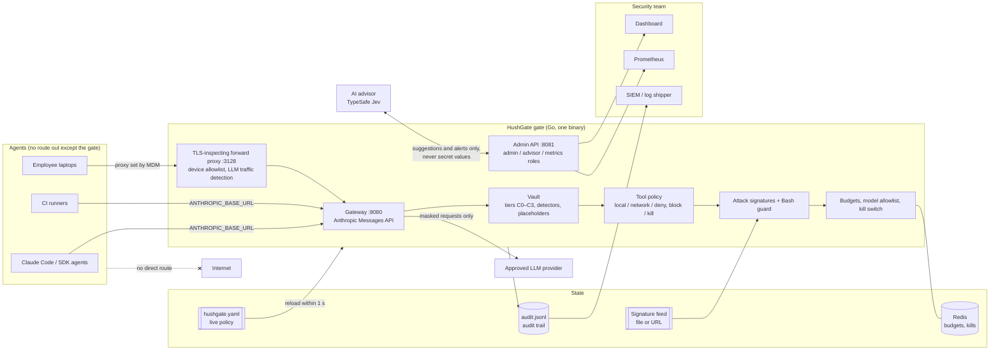
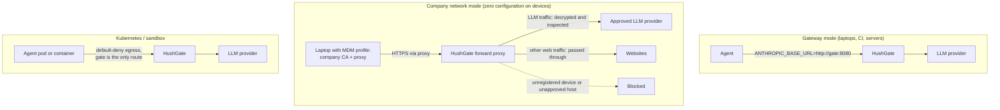

# 2 · Architecture

- [Architecture diagram](#architecture-diagram)
- [Request flow](#request-flow): where the deterministic and the AI checks run
- [Deployment modes](#deployment-modes)
- [Components](#components)
- [Performance metrics](performance.md) for deterministic and non-deterministic enforcement

## Architecture diagram


The image is drawn from [architecture.html](architecture.html); open it in a browser to edit it.

<details><summary>The same structure as a Mermaid diagram</summary>



</details>

**Trust boundaries:**
- Agents run on networks with no route out except the gate.
- The gate holds the provider key, so agents never do.
- The admin API listens on a separate port and needs a token. There are three roles:
  - **admin:** the dashboard, with full access.
  - **advisor:** may only read the queues and post suggestions and scores.
  - **metrics:** may only read `/metrics`.
- The AI advisor never receives secret values. It sees tool definitions, a value's *shape* (`payments-oncall` → `a8-a6`), and tool results after masking.

## Request flow

```mermaid
sequenceDiagram
  autonumber
  participant A as Agent
  participant G as HushGate
  participant R as Redis
  participant M as LLM provider
  participant J as AI advisor (Jev)

  A->>G: POST /v1/messages (may contain secrets and PII)
  G->>R: budget and kill check
  G->>G: model allowlist, vault masks secrets and PII
  G->>M: request with placeholders only
  M-->>G: streamed answer (text passes straight through)
  G->>G: tool call held until complete, then policy, Bash guard, 19 signatures
  alt local tool
    G-->>A: tool call with real values restored
  else network tool carrying protected data
    G-->>A: call dropped (block), or dropped and agent halted (kill)
  end
  G->>R: token usage
  G-)J: tool results queued for an injection scan (async)
  J--)G: score; above the threshold, a dashboard warning
  Note over G,J: The AI runs off the request path: it adds no latency and blocks nothing on its own.
```

Deterministic checks (steps 2–3 and 6) run inline, in microseconds. The AI checks (steps 9–10, and suggestions for the review queue) run in the background. Their results show up as warnings and suggestions, and as decisions only where `review.auto_accept` allows it.

## Deployment modes



All three modes run in this repository: `docker-compose.yml` (gateway mode, the scripted agent and sandboxed Claude Code) and `docker-compose.corp.yml` (a simulated company network with a registered laptop, a guest laptop, a self-hosted model and a fake internet). See [5-implementation](../5-implementation/README.md#deploying-into-existing-agent-ecosystems).

## Components

| Component | Technology | Responsibility |
|---|---|---|
| Gate | Go 1.26, a single static binary | Gateway and forward proxy; vault, policy, signatures, Bash guard, budgets; admin API; metrics |
| Vault | Go (`internal/vault`) | Classifies `.env` values into tiers with reasons; detects secrets and checksum-validated personal data in any text; replaces them with stable placeholders; restores them into local tools |
| Stream inspector | Go (`internal/gateway/stream.go`) | Passes server-sent events through as they arrive, holding each `tool_use` block until it is complete, then checking it |
| Forward proxy | Go (`internal/forward`) | `CONNECT` with TLS interception using the company CA; device identity from proxy credentials; LLM traffic recognised by shape (`internal/detect`) |
| Live config | Go (`internal/config`) | Polls the policy file, validates, diffs, applies atomically; writes review decisions back with comments kept |
| State | Redis 7 | Token usage and kill state per agent, shared by all gate replicas |
| Audit trail | JSON Lines file | Every decision with its reason; replayed into the dashboard after a restart; ready for log shippers |
| AI advisor | Python 3, TypeSafe Jev REST API | Injection scoring of tool results; suggestions for the review queue; never in the request path |
| Dashboard | React 19, Vite, Tailwind | Live view of decisions, agents, devices, the review queue, vault, signatures, policy and performance; audit export |
| Metrics | Prometheus client, Prometheus 3 | Latency histograms per stage, and counters for tool calls, masked values, signature hits, tokens, policy reloads and audit events |
