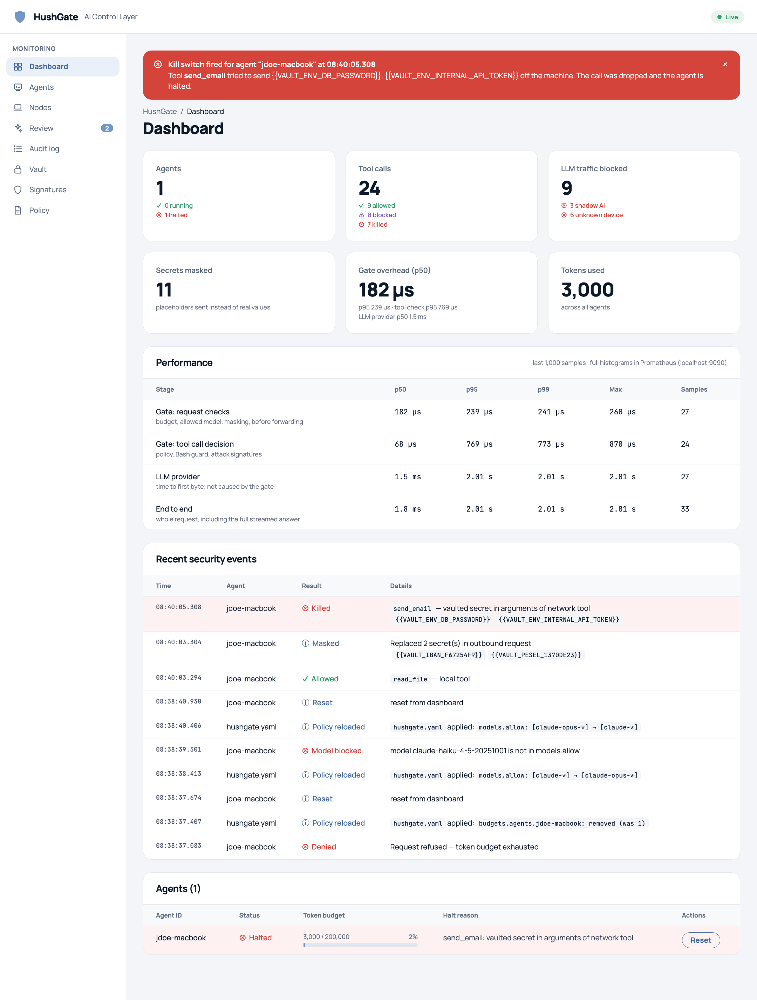
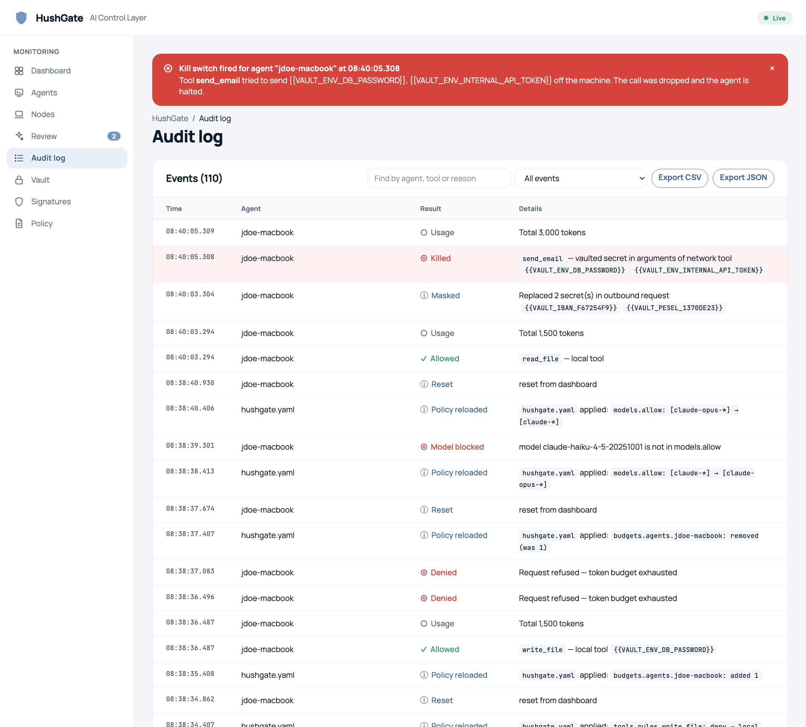
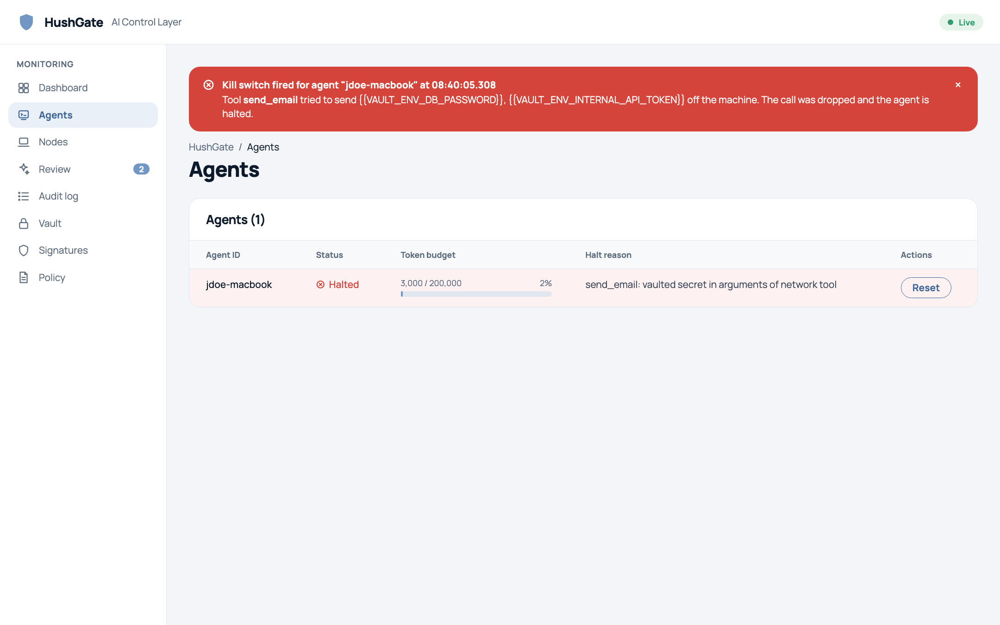
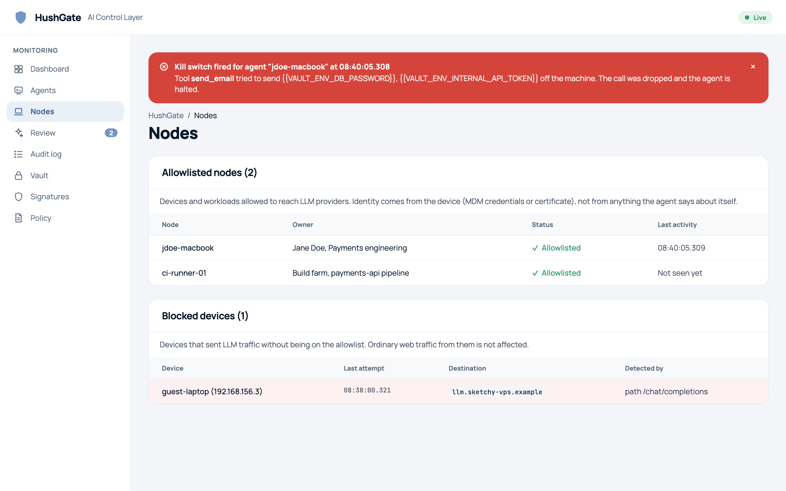
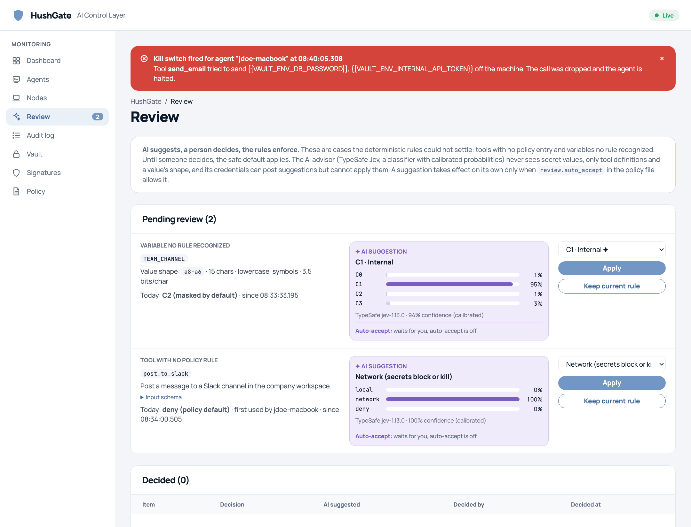
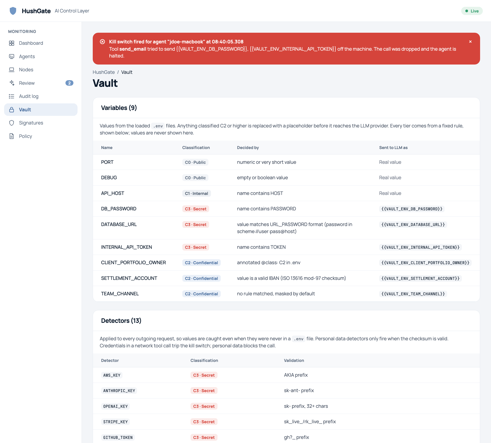
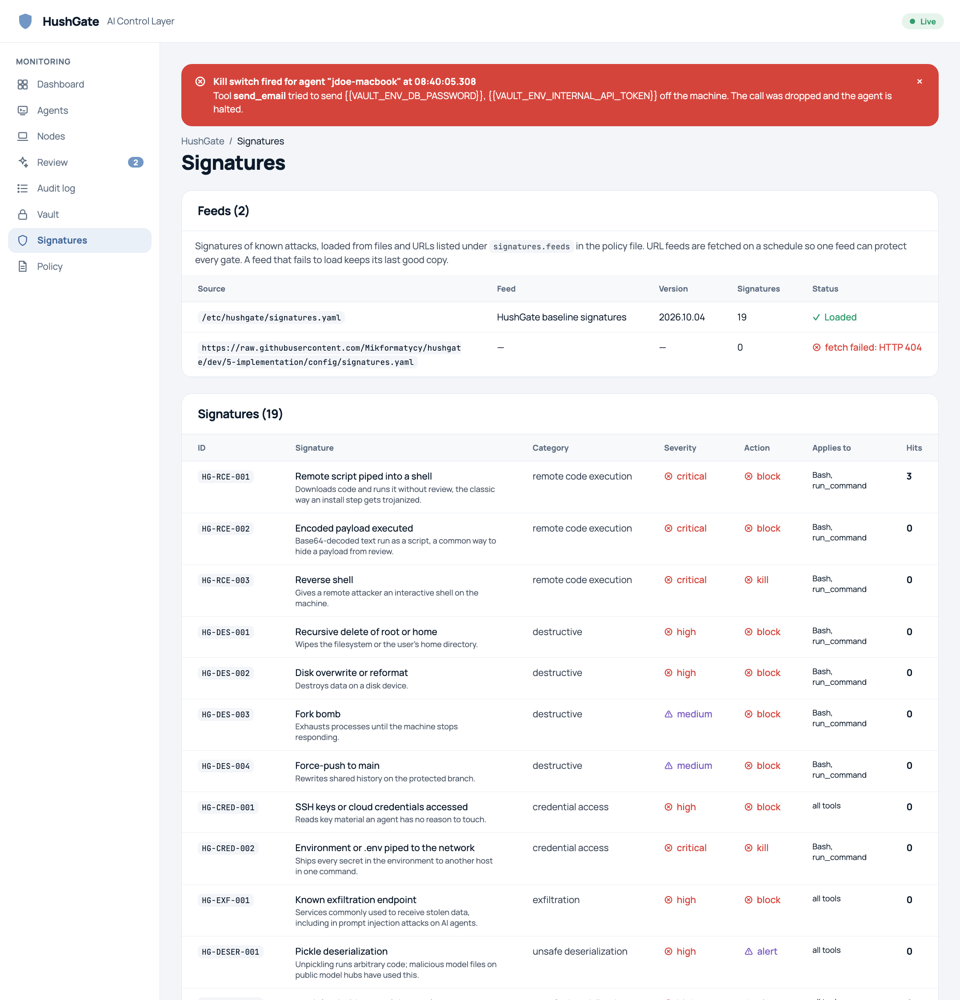
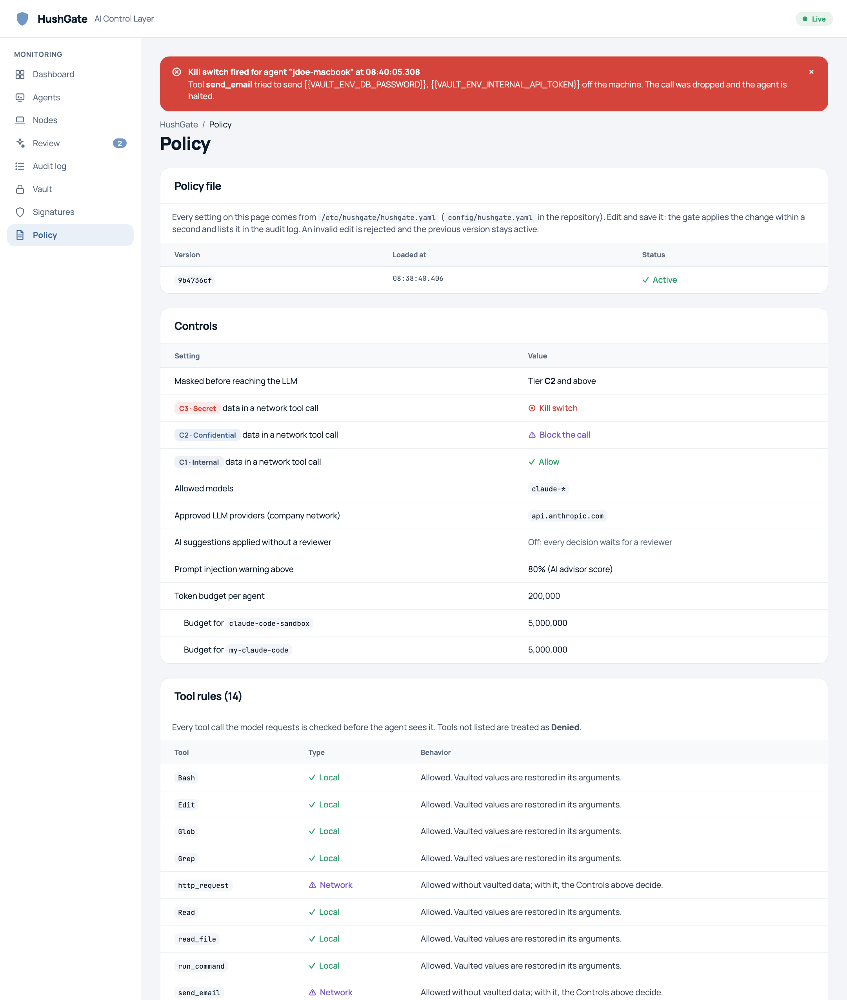
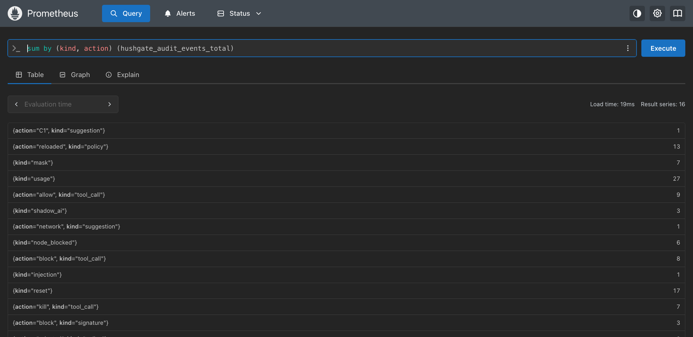
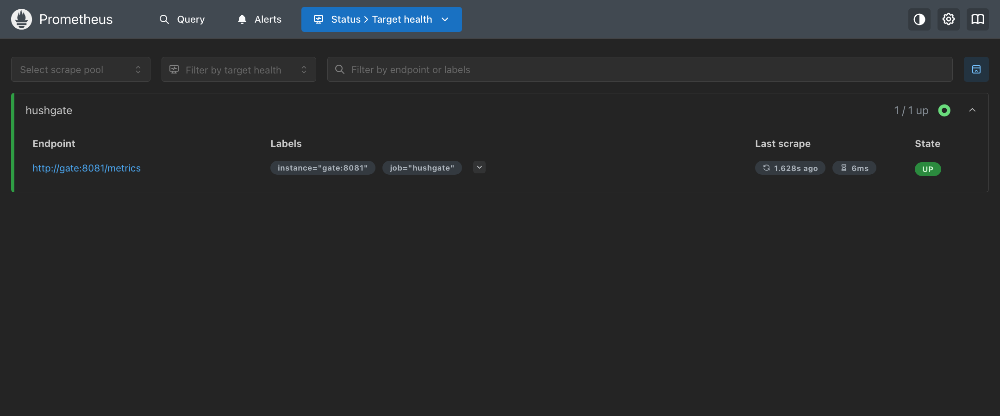

# 3 · Security reporting

HushGate reports through three channels, all fed by the same decisions:

1. **Live dashboard** for the security team (http://localhost:3000): alerts, decisions, agents, devices, the review queue, the vault, signatures, the policy and performance.
2. **Audit trail:** every decision with the rule behind it. It is kept as a durable JSON Lines file and exported as CSV or JSON for auditors and SIEMs.
3. **Prometheus metrics** for monitoring and alerting, with a Prometheus server included (http://localhost:9090).

Contents: [dashboard screenshots](#dashboard-screenshots) · [metrics](#implemented-metrics) · [audit trail](#audit-trail) · [example alerts](#example-alert-rules)

## Dashboard screenshots

All screenshots were taken from the running company-network demo after `just e2e`, so the data is real output of the gate.

### Overview

- **Kill banner:** the poisoned report made the agent try to email two secrets out. The call was dropped and the agent halted.
- **Cards:** agents, tool calls by result (allowed, blocked, killed), LLM traffic blocked (shadow AI and unknown devices), secrets masked, gate overhead and tokens.
- **Performance panel:** separates the gate's own latency (request checks p50 182 µs, tool decision p50 68 µs) from the provider's.
- **Recent security events:** includes IBAN and PESEL values sent as `{{VAULT_IBAN_…}}` and `{{VAULT_PESEL_…}}`, a model refused by the allowlist, a budget stop, and live policy reloads with their exact changes.

### Audit log

Every decision, filterable by kind, agent, blocked-only and free text. The same filter is exported as CSV or JSON.

### Agents

Each agent's token budget, its status (running or halted) and the reason it was halted, with a one-click reset.

### Nodes (devices)

Allowlisted devices and their last activity. Devices that sent LLM traffic without being allowed are listed with the destination and how the traffic was recognised.

### Review

Cases the rules could not settle, with the AI advisor's calibrated suggestion, why it was or wasn't applied automatically, and who decided.

### Vault

Each protected variable's tier, **the rule that decided it**, and how it is sent to the model. Also the personal-data detectors and the checksum each one uses.

### Signatures

The loaded feeds (local file and GitHub URL) with version and status, and the 19 signatures with severity, action and hit counts.

### Policy

The active policy file (version, load time, last rejected edit), every control's current setting, and the tool rules.

### Prometheus


Audit events by kind and action, queried in the bundled Prometheus, which scrapes the gate's `/metrics` endpoint with its own read-only token.

## Implemented metrics

### Prometheus (`/metrics` on the admin port; `METRICS_TOKEN` gives read-only access)

| Metric | Type | Labels | Meaning |
|---|---|---|---|
| `hushgate_requests_total` | counter | `route`, `code` | Requests handled by the gateway, by route and HTTP status |
| `hushgate_latency_seconds` | histogram | `stage` = `preprocess`, `tool_decision`, `upstream_first_byte`, `total` | Latency per stage. `preprocess` and `tool_decision` are the gate's own overhead, `upstream_first_byte` is the provider, `total` is end to end. Buckets run from 100 µs to 60 s. |
| `hushgate_tool_calls_total` | counter | `tool`, `action` | Tool calls the model requested, by final decision (`allow`, `block`, `kill`) |
| `hushgate_masked_values_total` | counter | `tier` | Sensitive values replaced with placeholders before leaving, by tier |
| `hushgate_signature_hits_total` | counter | `id`, `action` | Attack signature matches, by signature and action |
| `hushgate_llm_tokens_total` | counter | `agent` | Tokens used (input, output and cache), per agent |
| `hushgate_policy_reloads_total` | counter | `result` | Policy file reloads, `reloaded` or `rejected` |
| `hushgate_audit_events_total` | counter | `kind`, `action` | Every audit event by kind (below), so every decision type can be graphed and alerted on |

### Dashboard metrics (`/api/metrics/summary`)

- p50, p95, p99 and max per stage over the last 1,000 samples, shown on the Performance panel and the "Gate overhead" card.
- Counts on the overview cards:
  - agents running and halted;
  - tool calls allowed, blocked and killed;
  - shadow-AI and unknown-device blocks;
  - secrets masked;
  - tokens used, in total and per agent against its budget.

### Audit event kinds

| Kind | Raised when |
|---|---|
| `mask` | Secrets or personal data were replaced in an outgoing request (lists the placeholders, never the values) |
| `tool_call` | A tool call was allowed, blocked or killed, with the reason |
| `signature` | An attack signature matched (id, category, severity, the matched text) |
| `injection` | The AI advisor scored content an agent read above the threshold |
| `denied` | A request was refused: budget used up, or the agent is halted |
| `model_blocked` | The requested model is not on the allowlist |
| `shadow_ai` | LLM traffic to an unapproved or self-hosted provider |
| `node_blocked` | LLM traffic from a device that is not allowlisted |
| `suggestion`, `review` | An AI suggestion arrived; a decision was made (by a reviewer, by auto-accept, or by editing the file) |
| `policy` | The policy file reloaded (with the exact changes) or an edit was rejected (with the error) |
| `reset` | A halted agent was reset |
| `usage` | Tokens used by a request |

## Audit trail

- **Durable:** every event is appended to a JSON Lines file (`AUDIT_LOG_FILE`). The file can be shipped to a SIEM, and it refills the dashboard after a restart.
- **Export:** the Audit log page, `just export-csv` / `just export-json`, or `GET /api/audit/export?format=csv|jsonl`. Filters are `kind`, `agent`, `q` (free text) and `blocked=1` (blocked and killed only).
- **CSV columns:** `time, agent, kind, action, tool, host, reason, placeholders, usage`.
- **Safe to share:** exports and logs contain placeholder names such as `{{VAULT_ENV_DB_PASSWORD}}`, never secret values.

Real rows from the demo (`blocked=1`):

```csv
time,agent,kind,action,tool,host,reason,placeholders,usage
2026-10-04T06:34:07.056857975Z,jdoe-macbook,shadow_ai,,,llm.sketchy-vps.example,openai LLM request to unapproved host (path /chat/completions),,
2026-10-04T06:34:16.137391722Z,unregistered: guest-laptop (192.168.156.3),node_blocked,,,api.anthropic.com,anthropic LLM request from a device not on the agent allowlist (anthropic-version header),,
2026-10-04T06:34:16.159697094Z,unregistered: guest-laptop (192.168.156.3),node_blocked,,,llm.sketchy-vps.example,openai LLM request from a device not on the agent allowlist (path /chat/completions),,
2026-10-04T06:34:20.834895016Z,jdoe-macbook,tool_call,block,post_to_slack,,tool not permitted by policy,,
2026-10-04T06:34:27.496701885Z,jdoe-macbook,tool_call,kill,send_email,,vaulted secret in arguments of network tool,{{VAULT_ENV_DB_PASSWORD}};{{VAULT_ENV_INTERNAL_API_TOKEN}},
```

## Example alert rules

```yaml
groups:
  - name: hushgate
    rules:
      - alert: AgentKilled                     # an agent tried to send a secret out
        expr: increase(hushgate_tool_calls_total{action="kill"}[5m]) > 0
      - alert: PromptInjectionDetected
        expr: increase(hushgate_audit_events_total{kind="injection"}[5m]) > 0
      - alert: ShadowAI
        expr: increase(hushgate_audit_events_total{kind=~"shadow_ai|node_blocked"}[15m]) > 0
      - alert: PolicyEditRejected               # someone saved an invalid policy
        expr: increase(hushgate_policy_reloads_total{result="rejected"}[5m]) > 0
      - alert: GateOverheadHigh                 # the gate itself, not the provider
        expr: histogram_quantile(0.95, sum by (le) (rate(hushgate_latency_seconds_bucket{stage="preprocess"}[5m]))) > 0.005
```
