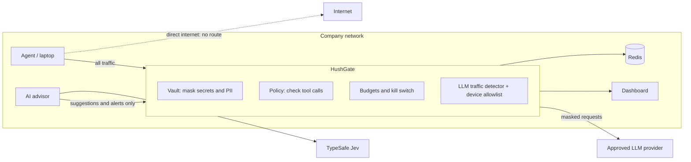

# HushGate

An AI control layer that sits between AI agents and LLM providers. Every request and every tool call an agent makes goes through it, so the organization can keep secrets and personal data away from the model, stop agents from taking actions they shouldn't, catch unapproved AI use, and cap spend. A dashboard shows what happened and why.

To run it: [RUN.md](RUN.md) (every task as one command), [INSTRUCTION.md](INSTRUCTION.md) (setups, scenarios, configuration) and [DEMO.md](DEMO.md) (the live demo, with prompts verified against real Claude Code).

## Problems it solves

| Risk | What the gate does |
|---|---|
| Secrets and personal data sent to an LLM provider | Replaces them with placeholders before the request leaves, and restores them only for approved local tools |
| Prompt injection turning an agent against its user | Blocks or kills tool calls that would carry secrets off the machine, and warns as soon as injected instructions reach the agent |
| Agents calling tools they shouldn't | Every tool call is checked against a policy before the agent sees it; unknown tools are denied by default |
| Shadow AI (unapproved models, self-hosted models, unregistered devices) | Recognizes LLM traffic by its shape on any host and allows only approved providers from allowlisted devices |
| Runaway cost | Per-agent token budgets with a hard stop |
| No visibility for security teams | Audit log of every decision, with the rule that made it, in a live dashboard |

## How it works



1. **Outgoing request.** The vault replaces known secrets (from `.env` files) and detected secrets and personal data (API keys, JWTs, private keys, IBAN, card numbers, PESEL, NIP) with stable placeholders like `{{VAULT_ENV_DB_PASSWORD}}`. The provider never sees the real values.
2. **Incoming response.** Each tool call the model requests is held until complete, then checked against the policy:
   - local tool (file write): allowed, placeholders swapped back for real values
   - network tool (email, HTTP) carrying a credential: dropped, agent halted (kill switch)
   - network tool carrying personal data: dropped, agent continues
   - unknown or denied tool: dropped
3. **Budgets.** Token usage is counted per agent in Redis; a halted or over-budget agent gets `403` until reset.
4. **Network.** Agents have no route to the internet except through the gate. In company network mode the gate is a TLS-inspecting forward proxy, so agents need no configuration at all.

### Hybrid controls: rules decide, AI advises

Enforcement is deterministic: the same input always gets the same decision, and every decision names the rule behind it. AI is used where rules can't decide, and never with the power to change anything on its own:

- **Review queue.** Tools missing from the policy and variables no rule recognized stay at the safe default (denied or masked). The AI advisor asks [TypeSafe Jev](https://docs.typesafe.ai), a classifier with calibrated probabilities, for a suggestion; a person applies or overrides it on the Review page.
- **Prompt injection early warning.** What agents read (tool results, already masked) is scored by Jev. A high score raises a dashboard alert, usually before the injected action is attempted. It never blocks.

The advisor sees tool definitions and the *shape* of a variable's value (`payments-oncall` becomes `a8-a6`), never secret values. Its token can post suggestions and alerts but cannot apply them.

## Controls

All controls are configured in `config/hushgate.yaml`:

| Control | Type | Configured in |
|---|---|---|
| Secret and PII masking, tiers C0–C3 | Deterministic: name rules, known formats, checksums, entropy | `masking`, `vault` (and `# @class: C3` in the `.env`) |
| Tool policy: local / network / deny | Deterministic | `tools` |
| Block or kill per tier when data reaches a network tool | Deterministic | `masking.on_network_tool` |
| Token budgets, per agent | Deterministic | `budgets` |
| Allowed models | Deterministic (glob patterns) | `models.allow` |
| Device allowlist, approved LLM hosts | Deterministic | `nodes`, `llm_hosts` |
| LLM traffic detection on any host | Deterministic: paths, headers, body shape | built in (`proxy/internal/detect`) |
| Known attack signatures: remote code execution, unsafe deserialization, model supply chain, credential theft, exfiltration | Deterministic: feed of patterns from files or URLs, refreshed on a schedule | `signatures` ([`config/signatures.yaml`](config/signatures.yaml)) |
| Bash guard: a shell command that reaches the network is treated as a network tool | Deterministic: command parsing that sees through quoting, `sudo`, `xargs`, `bash -c` | `bash_guard` |
| Egress lockdown | Network (Docker internal networks) | `docker-compose*.yml` |
| Review suggestions | AI (Jev), advisory | `TYPESAFE_API_KEY` |
| Prompt injection warning | AI (Jev), alert only | `injection.alert_threshold` (needs `TYPESAFE_API_KEY`) |

Everything in the right-hand column lives in one file, [`config/hushgate.yaml`](config/hushgate.yaml). The gate reloads it within a second of saving and logs exactly what changed; an invalid edit is rejected and the previous policy stays active. Decisions made on the Review page are written back into the file.

## Reporting

- **Dashboard** (http://localhost:3000): live audit log, blocked threats, budgets, devices, review queue, signatures, and a performance panel that separates the gate's own overhead (about 0.3 ms per request, under 0.2 ms per tool call in the demo) from the LLM provider's latency.
- **Audit trail**: every decision is appended to a JSON Lines file (`AUDIT_LOG_FILE`) that log shippers and SIEMs can ingest, and that refills the dashboard after a restart. The Audit log page exports it as CSV or JSON with the current filter. Exports and logs contain placeholder names, never secret values.
- **Prometheus** (`/metrics` on the admin port, its own `METRICS_TOKEN`): request counts and latency histograms per stage, tool calls by action, masked values by tier, signature hits, token usage per agent, policy reloads, and every audit event type. A Prometheus server is included at http://localhost:9090.

## Where it can run

- **Developer machines and CI, gateway mode.** Agents point at the gate (`ANTHROPIC_BASE_URL=http://gate:8080`), or a device-management profile sets it. The gate holds the real provider key, so agents never do. See `docker-compose.yml`.
- **Company network, forward-proxy mode.** Device management installs the company root CA and proxy settings at onboarding. The gate decrypts LLM traffic, identifies the device, and blocks LLM use from unregistered devices or to unapproved providers, including self-hosted models. Ordinary web traffic passes through. See `docker-compose.corp.yml`.
- **Servers and Kubernetes.** Agent workloads get default-deny egress with the gate as the only destination; the firewall, not the agent, guarantees nothing goes around it.
- **Sandboxed coding agents.** The repository runs real Claude Code in a container whose only network route is the gate (`just claude-sandbox`). It uses a normal Claude subscription; every request is masked, policed and logged, and a command the gate allows still cannot reach the internet directly.

Deep inspection (masking, tool policy, budgets) covers the Anthropic Messages API. Other LLM APIs (OpenAI, Ollama, Gemini) are recognized and allowed or blocked as a whole.

## Testing

57 automated tests cover allowed and blocked cases for every control, including false positives:

```sh
docker run --rm -v "$PWD":/src -w /src/proxy golang:1.26-alpine go test ./...
```

## Repository

```
proxy/       the gate (Go): gateway, forward proxy, vault, policy, budgets, admin API
dashboard/   React dashboard
advisor/     AI advisor (Python, TypeSafe Jev)
agent/       demo agent with read_file, write_file, send_email, post_to_slack, run_command
sandbox/     real Claude Code in a container that can only reach the gate
config/      hushgate.yaml (the policy) and signatures.yaml (attack signatures)
demo/        fake model, demo workspace, company network simulation
deploy/      Prometheus configuration
```

## Current limitations

- The review and injection queues live in memory and are rebuilt after a restart; audit events persist in the audit file, budgets and kills in Redis, review decisions in the policy file.
- Budgets are counted in tokens, not currency.

## Team

**Mikformatyka**, HackYeah 2026: Franciszek Fabiński (lead developer), Maciej Rapicki, Jan Bancerewicz, Karolina Glaza, Piotr Uszyński.
