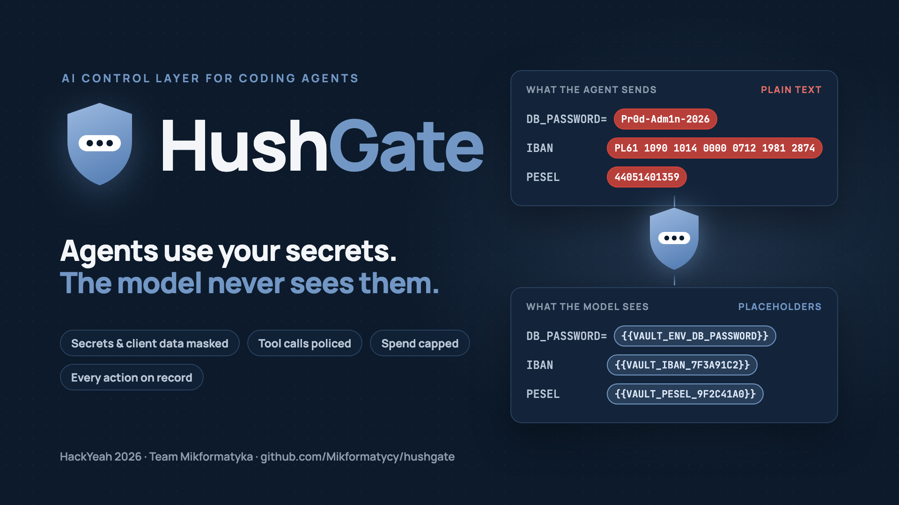
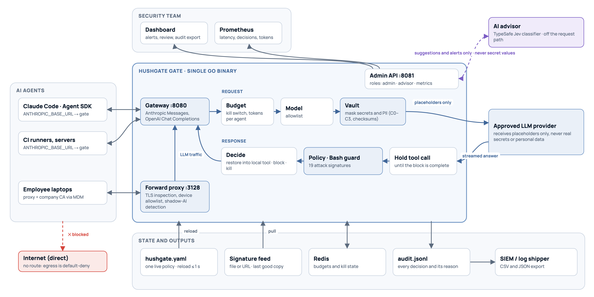

# HushGate



**An AI control layer for agents.** HushGate sits between every AI agent and every model provider. It keeps secrets and personal data away from the model, stops agents from taking actions they shouldn't, catches unapproved AI use and caps spend. Every decision is recorded with the rule that made it.



## The submission

| Section | Contents | Assessment criterion |
|---|---|---|
| [**1 · Solution**](1-solution/) | The approach, 20 controls and guardrails (each with the tests that prove it), a configuration reference, and strict and relaxed example policies | Robustness of the solution and quality of guardrails |
| [**2 · Architecture**](2-architecture/) | Architecture diagram, request flow, deployment modes, and [performance](2-architecture/performance.md) of deterministic and AI enforcement | Architecture and performance efficiency |
| [**3 · Reporting**](3-reporting/) | Dashboard screenshots, Prometheus metrics, the audit trail and its exports, example alert rules | Security reporting |
| [**4 · Testing**](4-testing/) | 74 automated tests, 19 end-to-end checks, 9 benchmarks, manual scenarios and a live demo script | Completeness of the self-testing suite |
| [**5 · Implementation**](5-implementation/) | The code, implementation notes, and deployment into existing agent ecosystems | Practical implementability and scalability |

## In numbers

- **0** plaintext secrets or personal-data values reached the model across the test scenarios.
- **≈ 0.1–0.2 ms** added by the gate per request (benchmark: 144 µs through the gate versus 30 µs direct; live demo p50: 174 µs). AI checks run off the request path and add nothing.
- **19** attack signatures from a central feed. **9** secret formats and **4** checksum-validated personal-data formats (IBAN, card, PESEL, NIP).
- **1 s** from saving the policy file to enforcing it. Invalid edits are rejected and the previous policy stays active.
- **2** API formats inspected end to end: Anthropic Messages (Claude Code, Anthropic SDKs) and OpenAI-compatible Chat Completions (OpenAI, OpenRouter and most hosted models).
- **19 / 19** end-to-end checks and **74** automated tests pass.

## Quick start

You need Docker. Optionally, put `TYPESAFE_API_KEY=...` in `.env` to enable the AI advisor.

```sh
git clone https://github.com/Mikformatycy/hushgate.git && cd hushgate
just corp-up     # simulated company network, offline: http://localhost:3000
just e2e         # run every scenario and check the results
just tests       # automated tests in Docker
```

Without [`just`](https://github.com/casey/just): `docker compose -f docker-compose.corp.yml up -d --build`, then `python3 4-testing/e2e.py`. Every command is in [5-implementation/RUN.md](5-implementation/RUN.md). Real Claude Code can run through the gate in a sandbox; see [4-testing/DEMO.md](4-testing/DEMO.md).

## Repository layout

```
1-solution/        overview, controls, configuration reference, example policies
2-architecture/    architecture diagram and performance
3-reporting/       screenshots, metrics, audit trail
4-testing/         test catalogue, end-to-end checker (e2e.py), live demo script
5-implementation/  all code: gate (Go), dashboard (React), AI advisor (Python), policy, demos
assets/            cover image and logo (SVG, PNG; HTML sources in assets/src)
docker-compose.yml        gateway mode (developer machines, CI, sandboxed Claude Code)
docker-compose.corp.yml   company network simulation
Justfile                  every task as one command
```

## Team

**Mikformatyka**, HackYeah 2026: Franciszek Fabiński (lead developer), Maciej Rapicki, Jan Bancerewicz, Karolina Glaza, Piotr Uszyński.
